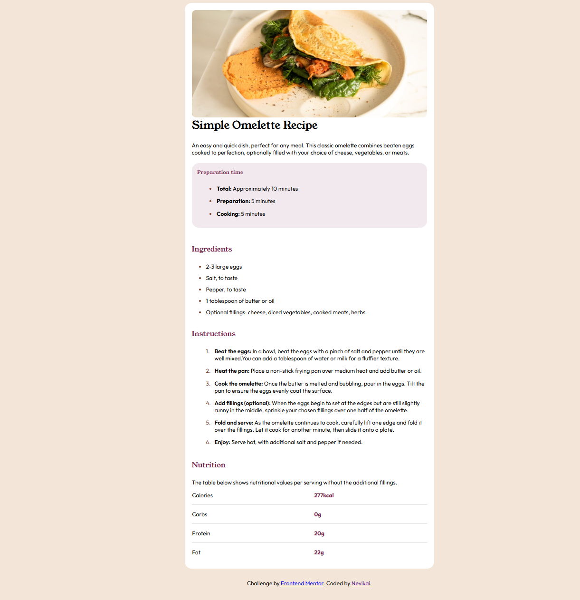

# Frontend Mentor - Recipe Page Solution

This is my solution to the [Recipe Page challenge on Frontend Mentor](https://www.frontendmentor.io/challenges/recipe-page-KiTsR8QQKm). This is the first project I built completely on my own. Previously, I had coded with the help of courses, but I realized that practicing alone through real challenges is much more effective. I found Frontend Mentor through research, and it really helped me start building projects independently.

Although I couldn’t get the Pro version of their site due to currency fluctuations in my country, I continued my efforts to learn and practice.

## Table of Contents

- [Overview](#overview)
- [My Process](#my-process)
  - [Built With](#built-with)
  - [What I Learned](#what-i-learned)
  - [Useful Resources](#useful-resources)
- [Author](#author)

## Overview

This project is a simple Recipe Page built to replicate the design provided by Frontend Mentor. It includes sections for preparation time, ingredients, instructions, and nutrition information.

### Screenshot

### Links

- Solution URL: [Frontend Mentor Recipe Page Challenge](https://www.frontendmentor.io/challenges/recipe-page-KiTsR8QQKm)
- Live Site URL: [View Live Site](https://front-end-training-nevikai.github.io/social-link-profile/)

## My Process

### Built With

- HTML
- CSS

### What I Learned

During this project, I learned:

- How to style tables with custom designs.
- How to use `::marker` for customizing list bullets.

Even though I had learned these concepts before, I had mostly forgotten them and this project helped me practice and reinforce them.

### Useful Resources

- [Medium](https://medium.com/)
- [W3Schools](https://www.w3schools.com/)
- ChatGPT, for debugging and finding solutions to my code issues.

## Author

- Name: Ali Novikai
- Frontend Mentor - [@Nevikai](https://www.frontendmentor.io/profile/Nevikai)
